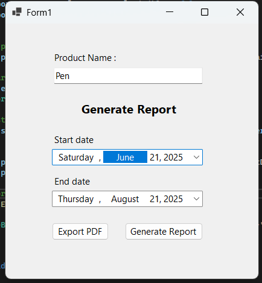
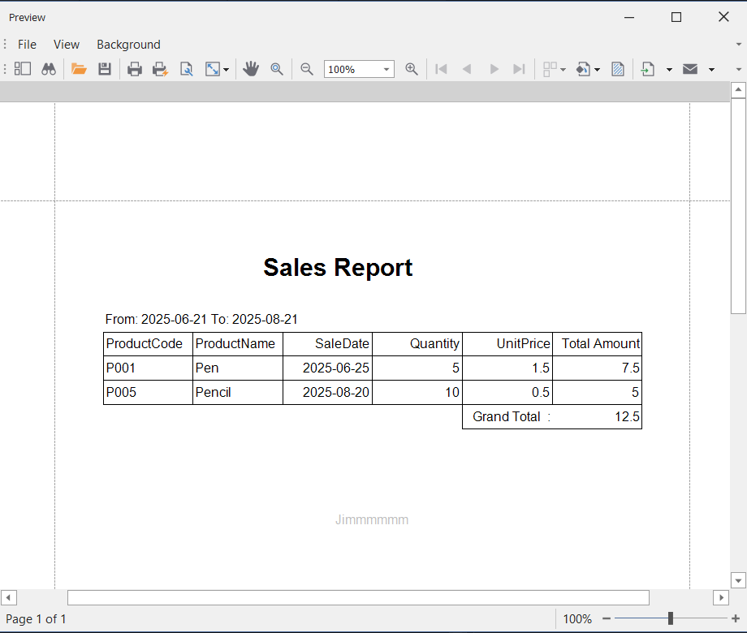
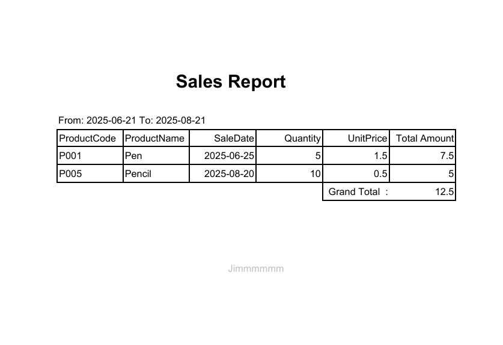

# Product Sales Reporting Tool

## Overview
This is a WinForms application in C# that connects to a SQL Server database, fetches product sales data, and displays it using DevExpress XtraReport. It supports date range filtering, optional product name filtering, totals, and PDF export.

---

## Setup Steps

1. **Clone the repository**
```bash
git clone https://github.com/jimtwenty2/TonaireProject.git
cd TonaireProject
```
2. Open the solution
- Open TonaireProject.sln in VS 2022 or later.

3 Install DevExpress Reporting
- Ensure DevExpress components are installed.
- Required assemblies : 
	DevExpress.Data.vXX.X.dll
  DevExpress.XtraReports.vXX.X.dll
  DevExpress.Printing.vXX.X.Core.dll

4 Configure Database ( MSSQLSERVER )
```
<connectionStrings>
    <add name="saledb"
         connectionString="Data Source=YOUR_SERVER;Initial Catalog=saledb;uid=YOUR_USERNAME; password=YOUR_PASSWORD; encrypt=false;"
         providerName="System.Data.SqlClient" />
</connectionStrings>
```
- Place this in App.config (project root).

5. Create and seed the database
Run the SQL script ProductSaleScriptSql.sql included in the repository.
It will create the ProductSales table and insert sample data and a Stored Procedure.

6. Run the application
Select Start Date and End Date, optionally enter a Product Name.
Click Generate Report to view data in DevExpress XtraReport.

7. Export Report
Use the Export button to save the report as PDF. The file is stored in ProjectPdf folder inside the project root.

## Screenshots

### Application

UI  

### Sample Report 

 

### Sample Pdf 


